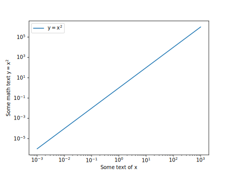
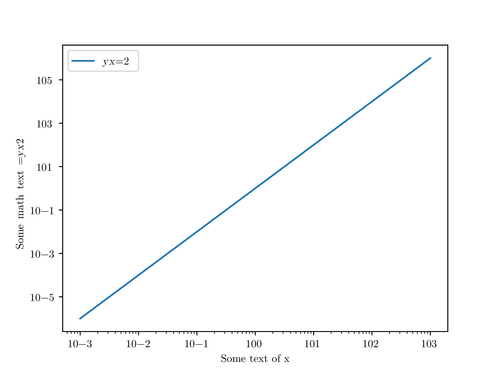

# mpl-inkscape
Matplotlib backend for exporting Inkscape svg + TeX math

## Purpose of backend

The vector graphic designer `Inkscape` is a powerful tool combining
`svg` with `TeX` by using its `pdf+LaTeX` () exporting engine. One can
easily edit the math equations / symbols / formulae in a way close to
WYSIWYG and render using `TeX` engines without the steep learning
curve of other TeX tools like `pgf` or `Tikz`. The `pdf+LaTeX`
workflow ensures consistent typesetting appearance in the rendered
figure and main text, and a simple tutorial can be found in
[CTAN](http://tug.ctan.org/info/svg-inkscape/InkscapePDFLaTeX.pdf).

The default svg backend of matplotlib works nicely to generate a
svg file, however the math notations in text and axis labels are
exported as collections of glyphs with pre-computed
coordinates. TeX rendering using such svg file will not work

Directly using svg files exported by original svg backend
will cause the math equations to break after TeX rendering. As an example, 
 
